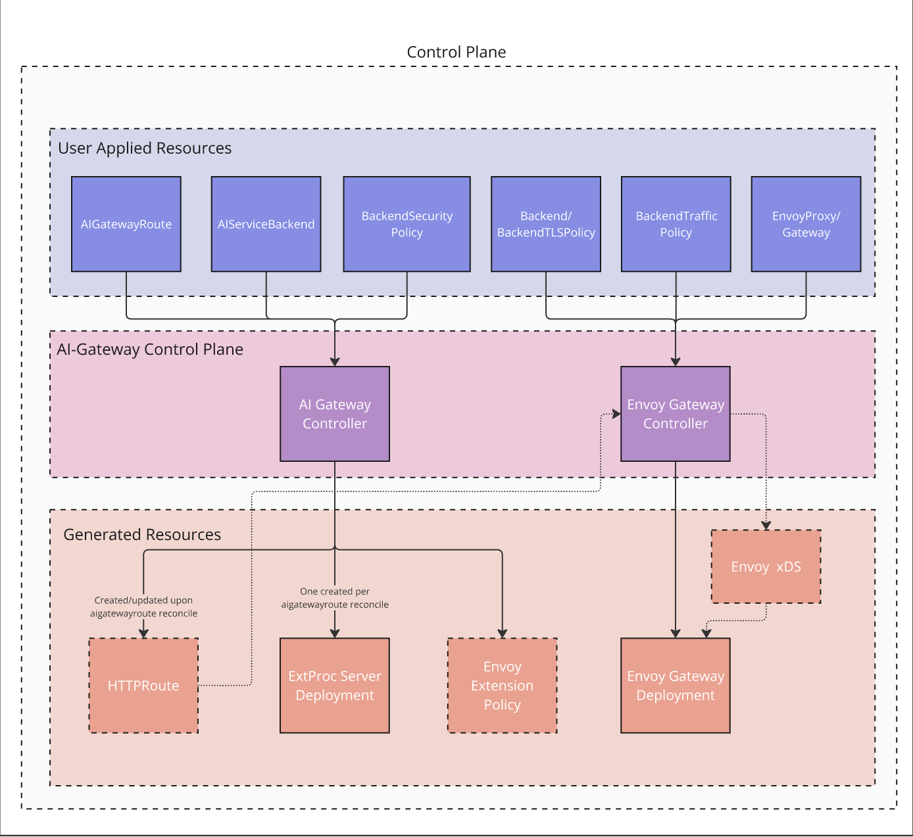
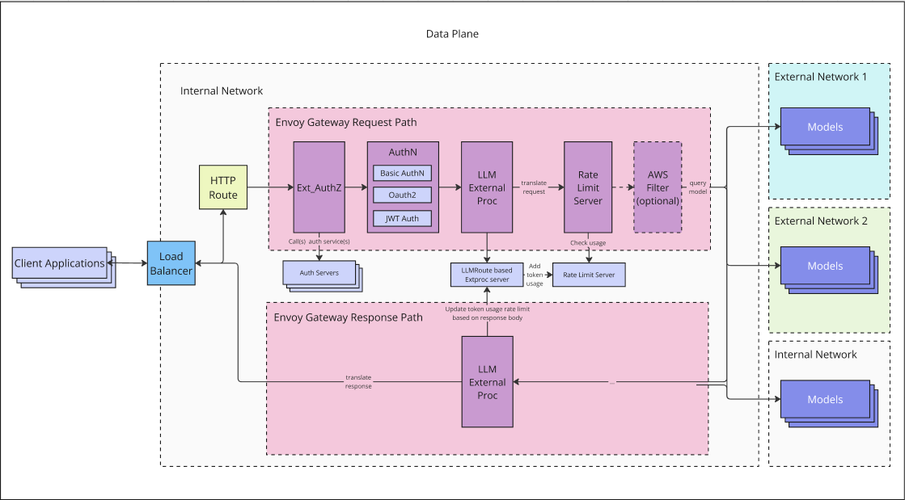

# Envoy AI Gateway

## Table of Contents

<!-- toc -->

-   [Summary](#summary)
-   [Goals](#goals)
-   [Non-Goals](#non-goals)
-   [Proposal](#proposal)
    -   [Personas](#personas)
    -   [Axioms](#axioms)
    -   [AIGatewayRoute](#aigatewayroute)
    -   [AIServiceBackend](#aiservicebackend)
    -   [BackendSecurityPolicy](#backendsecuritypolicy)
    -   [Token Usage based Rate Limiting](#token-usage-rate-limiting)
    -   [Diagrams](#diagrams)

<!-- /toc -->

## Summary
The `Envoy AI Gateway` is to act as a centralized access point for managing and controlling access to various AI models within an organization.
It provides a single interface for developers to interact with different AI Services while ensuring security, governance and observability over AI traffic.

It introduces new Custom Resource Definitions(CRD) to support the requirements of the `Envoy AI Gateway`: **AIGatewayRoute**, **AIServiceBackend** and **BackendSecurityPolicy**.

* The `AIGatewayRoute` specifies the schema for the user requests and routing rules to the `AIServiceBackend`s.
* The `AIServiceBackend` defines the AI service backend schema and security policy for various AI Services. This resource is managed by the Inference Platform Admin persona.
* The `BackendSecurityPolicy` defines the authentication policy for upstream AI services using API key or cloud credentials.
* Rate Limiting for LLM workload is based on tokens, we extend `Envoy Gateway` to support generic cost based rate limiting as envoy so far only supports request based rate limiting.

## Goals

- Drive the consensus on the `Envoy AI Gateway` API for the MVP features:
  - Upstream Model Access: Support accessing models from an initial list of AI Services: AWS Bedrock, OpenAI.
  - Unified Client Access: Support a unified AI gateway API across AI Services.
  - Traffic Management: Monitor and regulate AI service traffic, including token rate limiting by tracking token usages for LLM models.
  - Observability: Provide detailed insights into usage patterns, performance and potential issues through logging and metrics collection.
  - Policy Enforcement: Allow organizations to set specific rules and guidelines for how AI models can be accessed and used.
- Documentation of API decisions for posterity.

## Non-Goals

- non-MVP features
- Routing for LLM serving instances in a Kubernetes cluster

## Proposal

### Personas

Before diving into the details of the API, descriptions of the personas will help shape the thought process of the API design.

#### Inference Platform Admin

The Inference Platform Admin manages the gateway infrastructure necessary to route inference requests to a variety of AI Services.
Including handling Ops for:
  - A list of AI Services and supported models.
  - AI Services API schema conversion and centralized upstream authentication configurations.
  - Traffic policy including rate limiting, fallback resilience between AI Service backends.

#### Payment Team

- Reports per user/tenant/model LLM token usage for billing purpose.

#### Security Team

- Security team to control the ACL for accessing the models from AI Services.

### Axioms

The API design is based on these axioms:

- This solution should be composable with other Gateway solutions.
- Gateway architecture should be extensible when customization is required.
- The MVP heavily assumes that the requests are sent using the OpenAI spec, but open to the extension in the future.


### AIGatewayRoute

`AIGatewayRoute` defines the unified user request schema and the routing rules to a list of supported `AIServiceBackend`s such as AWS Bedrock, GCP Vertex AI, Azure OpenAI and KServe for self-hosted LLMs.

- `AIGatewayRoute` serves as a way to define the unified AI Gateway API which allows downstream clients to use a single schema API to interact with multiple `AIServiceBackend`s.
- `AIGatewayRoute`s are defined to route to the `AIServiceBackend`s based on the HTTP header/path matching. The rules are matched in the `Envoy AI Gateway` external proc as the backend needs to be determined for request body transformation and upstream authentication.
The `HTTPRoute` handles upstream routing once backend is selected using the AI gateway routing header.


```golang
// AIGatewayRouteSpec details the AIGatewayRoute configuration.
type AIGatewayRouteSpec struct {
// TargetRefs are the names of the Gateway resources this AIGatewayRoute is being attached to.
//
// +kubebuilder:validation:MinItems=1
// +kubebuilder:validation:MaxItems=128
TargetRefs []gwapiv1a2.LocalPolicyTargetReferenceWithSectionName `json:"targetRefs"`
// APISchema specifies the API schema of the input that the target Gateway(s) will receive.
// Based on this schema, the ai-gateway will perform the necessary transformation to the
// output schema specified in the selected AIServiceBackend during the routing process.
//
// Currently, the only supported schema is OpenAI as the input schema.
//
// +kubebuilder:validation:Required
// +kubebuilder:validation:XValidation:rule="self.name == 'OpenAI'"
APISchema VersionedAPISchema `json:"schema"`
// Rules is the list of AIGatewayRouteRule that this AIGatewayRoute will match the traffic to.
// Each rule is a subset of the HTTPRoute in the Gateway API (https://gateway-api.sigs.k8s.io/api-types/httproute/).
//
// AI Gateway controller will generate a HTTPRoute based on the configuration given here with the additional
// modifications to achieve the necessary jobs, notably inserting the AI Gateway filter responsible for
// the transformation of the request and response, etc.
//
// In the matching conditions in the AIGatewayRouteRule, `x-ai-eg-model` header is available
// if we want to describe the routing behavior based on the model name. The model name is extracted
// from the request content before the routing decision.
//
// How multiple rules are matched is the same as the Gateway API. See for the details:
// https://gateway-api.sigs.k8s.io/reference/spec/#gateway.networking.k8s.io%2fv1.HTTPRoute
//
// +kubebuilder:validation:Required
// +kubebuilder:validation:MaxItems=128
Rules []AIGatewayRouteRule `json:"rules"`

// FilterConfig is the configuration for the AI Gateway filter inserted in the generated HTTPRoute.
//
// An AI Gateway filter is responsible for the transformation of the request and response
// as well as the routing behavior based on the model name extracted from the request content, etc.
//
// Currently, the filter is only implemented as an external process filter, which might be
// extended to other types of filters in the future. See https://github.com/envoyproxy/ai-gateway/issues/90
FilterConfig *AIGatewayFilterConfig `json:"filterConfig,omitempty"`

// LLMRequestCosts specifies how to capture the cost of the LLM-related request, notably the token usage.
// The AI Gateway filter will capture each specified number and store it in the Envoy's dynamic
// metadata per HTTP request. The namespaced key is "io.envoy.ai_gateway",
//
// For example, let's say we have the following LLMRequestCosts configuration:
//
//	llmRequestCosts:
//	- metadataKey: llm_input_token
//	  type: InputToken
//	- metadataKey: llm_output_token
//	  type: OutputToken
//	- metadataKey: llm_total_token
//	  type: TotalToken
//
// Then, with the following BackendTrafficPolicy of Envoy Gateway, you can have three
// rate limit buckets for each unique x-user-id header value. One bucket is for the input token,
// the other is for the output token, and the last one is for the total token.
// Each bucket will be reduced by the corresponding token usage captured by the AI Gateway filter.
//
// +optional
// +kubebuilder:validation:MaxItems=36
LLMRequestCosts []LLMRequestCost `json:"llmRequestCosts,omitempty"`
}

// AIGatewayRouteRule is a rule that defines the routing behavior of the AIGatewayRoute.
type AIGatewayRouteRule struct {
// BackendRefs is the list of AIServiceBackend that this rule will route the traffic to.
// Each backend can have a weight that determines the traffic distribution.
//
// The namespace of each backend is "local", i.e. the same namespace as the AIGatewayRoute.
//
// +optional
// +kubebuilder:validation:MaxItems=128
BackendRefs []AIGatewayRouteRuleBackendRef `json:"backendRefs,omitempty"`

// Matches is the list of AIGatewayRouteMatch that this rule will match the traffic to.
// This is a subset of the HTTPRouteMatch in the Gateway API. See for the details:
// https://gateway-api.sigs.k8s.io/reference/spec/#gateway.networking.k8s.io%2fv1.HTTPRouteMatch
//
// +optional
// +kubebuilder:validation:MaxItems=128
Matches []AIGatewayRouteRuleMatch `json:"matches,omitempty"`
}

// LLMRequestCost specifies "where" the request cost is stored in the filter metadata as well as
// "how" the cost is calculated. By default, the cost is retrieved from "output token" in the response body.
//
// This can be used to subtract the usage token from the usage quota in the rate limit filter when
// the request completes combined with `apply_on_stream_done` and `hits_addend` fields of
// the rate limit configuration https://www.envoyproxy.io/docs/envoy/latest/api-v3/config/route/v3/route_components.proto#config-route-v3-ratelimit
// which is introduced in Envoy 1.33 (to be released soon as of writing).
type LLMRequestCost struct {
// MetadataKey is the key of the metadata storing the request cost.
MetadataKey string `json:"metadataKey"`
// Type is the kind of the request cost calculation.
Type LLMRequestCostType `json:"type"`
// CELExpression is the CEL expression to calculate the cost of the request.
// This is not empty when the Type is LLMRequestCostTypeCELExpression.
CELExpression string `json:"celExpression,omitempty"`
}
```


### AIServiceBackend

`AIServiceBackend` defines the AI service API schema and a reference to the `Envoy Gateway` backend for the target destination.

- The Gateway routes the traffic to the appropriate `AIServiceBackend` by converting the unified API schema to the AI service API schema.
- The `AIServiceBackend` is attached with the `BackendSecurityPolicy` to perform the upstream authentication.

```golang
// AIServiceBackendSpec details the AIServiceBackend configuration.
type AIServiceBackendSpec struct {
// APISchema specifies the API schema of the output format of requests from
// Envoy that this AIServiceBackend can accept as incoming requests.
// Based on this schema, the ai-gateway will perform the necessary transformation for
// the pair of AIGatewayRouteSpec.APISchema and AIServiceBackendSpec.APISchema.
//
// This is required to be set.
//
// +kubebuilder:validation:Required
APISchema VersionedAPISchema `json:"schema"`
// BackendRef is the reference to the Backend resource that this AIServiceBackend corresponds to.
//
// A backend can be of either k8s Service or Backend resource of Envoy Gateway.
//
// This is required to be set.
//
// +kubebuilder:validation:Required
BackendRef gwapiv1.BackendObjectReference `json:"backendRef"`

// BackendSecurityPolicyRef is the name of the BackendSecurityPolicy resources this backend
// is being attached to.
//
// +optional
BackendSecurityPolicyRef *gwapiv1.LocalObjectReference `json:"backendSecurityPolicyRef,omitempty"`
}
```

### BackendSecurityPolicy
The `BeckendSecurityPolicy` defines the authentication methods of the upstream AI service. `APIKey` provides a simple authentication method to
authenticate with upstream AI services such as OpenAI or Anthropic. For accessing models via cloud providers such as AWS, GCP, the cloud credential is managed with Kubernetes secrets or exchanged
using OIDC federation.

```golang
// BackendSecurityPolicySpec specifies authentication rules on access the provider from the Gateway.
// Only one mechanism to access a backend(s) can be specified.
//
// Only one type of BackendSecurityPolicy can be defined.
// +kubebuilder:validation:MaxProperties=2
type BackendSecurityPolicySpec struct {
// Type specifies the auth mechanism used to access the provider. Currently, only "APIKey", AND "AWSCredentials" are supported.
//
// +kubebuilder:validation:Enum=APIKey;AWSCredentials
Type BackendSecurityPolicyType `json:"type"`

// APIKey is a mechanism to access a backend(s). The API key will be injected into the Authorization header.
//
// +optional
APIKey *BackendSecurityPolicyAPIKey `json:"apiKey,omitempty"`

// AWSCredentials is a mechanism to access a backend(s). AWS specific logic will be applied.
//
// +optional
AWSCredentials *BackendSecurityPolicyAWSCredentials `json:"awsCredentials,omitempty"`
}
// BackendSecurityPolicyAWSCredentials contains the supported authentication mechanisms to access aws
type BackendSecurityPolicyAWSCredentials struct {
// Region specifies the AWS region associated with the policy.
//
// +kubebuilder:validation:MinLength=1
Region string `json:"region"`

// CredentialsFile specifies the credentials file to use for the AWS provider.
//
// +optional
CredentialsFile *AWSCredentialsFile `json:"credentialsFile,omitempty"`

// OIDCExchangeToken specifies the oidc configurations used to obtain an oidc token. The oidc token will be
// used to obtain temporary credentials to access AWS.
//
// +optional
OIDCExchangeToken *AWSOIDCExchangeToken `json:"oidcExchangeToken,omitempty"`
}
```

### Token Usage Rate Limiting

AI Gateway project extended the `Envoy Gateway` `BackendTrafficPolicy` with a generic usage based rate limiting in [#4957](https://github.com/envoyproxy/gateway/pull/4957).
For supporting token usage based rate limiting, it reduces the rate limit counter in the response path. Since the reduction happens after the response is complete, the rate limiting is not enforced for the current but the subsequent requests.
The token usages are extracted from the standard token usage fields according to the OpenAI schema in the ext proc `processResponseBody` handler.

```go
type RateLimitCost struct {
	// Request specifies the number to reduce the rate limit counters
	// on the request path. If this is not specified, the default behavior
	// is to reduce the rate limit counters by 1.
	//
	// When Envoy receives a request that matches the rule, it tries to reduce the
	// rate limit counters by the specified number. If the counter doesn't have
	// enough capacity, the request is rate limited.
	//
	// +optional
	// +notImplementedHide
	Request *RateLimitCostSpecifier `json:"request,omitempty"`
	// Response specifies the number to reduce the rate limit counters
	// after the response is sent back to the client or the request stream is closed.
	//
	// The cost is used to reduce the rate limit counters for the matching requests.
	// Since the reduction happens after the request stream is complete, the rate limit
	// won't be enforced for the current request, but for the subsequent matching requests.
	//
	// This is optional and if not specified, the rate limit counters are not reduced
	// on the response path.
	//
	// Currently, this is only supported for HTTP Global Rate Limits.
	//
	// +optional
	// +notImplementedHide
	Response *RateLimitCostSpecifier `json:"response,omitempty"`
}
// RateLimitCostSpecifier specifies where the Envoy retrieves the number to reduce the rate limit counters.
//
// +kubebuilder:validation:XValidation:rule="!(has(self.number) && has(self.metadata))",message="only one of number or metadata can be specified"
type RateLimitCostSpecifier struct {
// From specifies where to get the rate limit cost. Currently, only "Number" and "Metadata" are supported.
//
// +kubebuilder:validation:Required
From RateLimitCostFrom `json:"from"`
// Number specifies the fixed usage number to reduce the rate limit counters.
// Using zero can be used to only check the rate limit counters without reducing them.
//
// +optional
// +notImplementedHide
Number *uint64 `json:"number,omitempty"`
// Metadata specifies the per-request metadata to retrieve the usage number from.
//
// +optional
// +notImplementedHide
Metadata *RateLimitCostMetadata `json:"metadata,omitempty"`
}
// RateLimitCostMetadata specifies the filter metadata to retrieve the usage number from.
type RateLimitCostMetadata struct {
// Namespace is the namespace of the dynamic metadata.
//
// +kubebuilder:validation:Required
Namespace string `json:"namespace"`
// Key is the key to retrieve the usage number from the filter metadata.
//
// +kubebuilder:validation:Required
Key string `json:"key"`
}
```

```go
/// RateLimitRule defines the semantics for matching attributes
// from the incoming requests, and setting limits for them.
type RateLimitRule struct {
// ClientSelectors holds the list of select conditions to select
// specific clients using attributes from the traffic flow.
// All individual select conditions must hold True for this rule
// and its limit to be applied.
//
// If no client selectors are specified, the rule applies to all traffic of
// the targeted Route.
//
// If the policy targets a Gateway, the rule applies to each Route of the Gateway.
// Please note that each Route has its own rate limit counters. For example,
// if a Gateway has two Routes, and the policy has a rule with limit 10rps,
// each Route will have its own 10rps limit.
//
// +optional
// +kubebuilder:validation:MaxItems=8
ClientSelectors []RateLimitSelectCondition `json:"clientSelectors,omitempty"`
// Limit holds the rate limit values.
// This limit is applied for traffic flows when the selectors
// compute to True, causing the request to be counted towards the limit.
// The limit is enforced and the request is rate limited, i.e. a response with
// 429 HTTP status code is sent back to the client when
// the selected requests have reached the limit.
Limit RateLimitValue `json:"limit"`
// Cost specifies the cost of requests and responses for the rule.
//
// This is optional and if not specified, the default behavior is to reduce the rate limit counters by 1 on
// the request path and do not reduce the rate limit counters on the response path.
//
// +optional
// +notImplementedHide
Cost *RateLimitCost `json:"cost,omitempty"`
}
```

### Yaml Examples

#### AIGatewayRoute
The routing calculation in done in the `ExtProc` by analyzing the match rules on `AIGatewayRoute` spec to emulate the behavior in order to perform the AI Service specific transformation and authentication before the routing filter is applied,
 because it happens at the very end of the filter chain.

The `AIServiceBackend` rules are specified on the `AIGatewayRoute` based on model header matching, in this example `anthropic.claude-3-5-sonnet` is routed to the AWS Bedrock and `llama-3.3-70b-instruction` is routed to the KServe backend for the self-hosted llama model.
`LLMRequestCost` is specified with the metadata key `llm_total_token` to store the cost of the LLM request.

```yaml
apiVersion: aigateway.envoyproxy.io/v1alpha1
kind: AIGatewayRoute
metadata:
  name: llmroute
  namespace: ai-gateway
spec:
  targetRefs:
    - group: gateway.networking.k8s.io
      kind: Gateway
      name: eg
  schema:
    name: OpenAI
  rules:
    - matches:
        - headers:
            - type: Exact
              name: x-ai-eg-model
              value: anthropic.claude-3-5-sonnet-20240620-v1:0
      backendRefs:
        - name: awsbedrock-backend
    - matches:
        - headers:
            - type: Exact
              name: x-ai-eg-model
              value: llama-3.3-70b-instruction
      backendRefs:
        - name: kserve-llama-backend
  # The following metadata keys are used to store the costs from the LLM request.
  llmRequestCosts:
    - metadataKey: llm_total_token
      type: TotalToken
  filterConfig:
    externalProcess:
      replicas: 1
```

#### BackendSecurityPolicy
`BackendSecurityPolicy` specifies the API key or credentials that `Envoy AI Gateway` uses to authenticate with the upstream AI service.
In this example API key is used to authenticate with OpenAI service and AWS credential is used to authenticate with AWS Bedrock service.
```yaml
apiVersion: aigateway.envoyproxy.io/v1alpha1
kind: BackendSecurityPolicy
metadata:
  name: aws-bedrock-credential
  namespace: default
spec:
  type: AWSCredentials
  awsCredentials:
    region: us-east-1
    credentialsFile:
      secretRef:
        name: aws-credential
      profile: default
---
apiVersion: aigateway.envoyproxy.io/v1alpha1
kind: BackendSecurityPolicy
metadata:
  name: openai-ai-key
  namespace: default
spec:
  type: APIKey
  apiKey:
    secretRef:
      name: openai-api-key
```

#### AIServiceBackend
Based on the gateway routes, we define the AWS Bedrock and KServe `AIServiceBackend` along with the `Envoy Gateway` backend resource using the FQDN for the routing destination.
```yaml
apiVersion: aigateway.envoyproxy.io/v1alpha1
kind: AIServiceBackend
metadata:
  name: awsbedrock-backend
  namespace: ai-gateway
spec:
  schema:
    name: "AWSBedrock"
  backendRef:
    group: "gateway.envoyproxy.io"
    kind: "Backend"
    name: "llm-bedrock-backend"
  BackendSecurityPolicyRef:
    group: "aigateway.envoyproxy.io"
    kind: "BackendSecurityPolicy"
    name: "aws-bedrock-credential"
---
apiVersion: aigateway.envoyproxy.io/v1alpha1
kind: AIServiceBackend
metadata:
  name: kserve-llama-backend
  namespace: ai-gateway
spec:
  schema:
    name: "OpenAI"
  backendRef:
    group: "gateway.envoyproxy.io"
    kind: "Backend"
    name: "kserve-llama-backend"
  BackendSecurityPolicyRef:
    group: "aigateway.envoyproxy.io"
    kind: "BackendSecurityPolicy"
    name: "openai-ai-key"
---
apiVersion: gateway.envoyproxy.io/v1alpha1
kind: Backend
metadata:
  name: kserve-llama-backend
  namespace: ai-gateway
spec:
  endpoints:
    - fqdn:
        hostname: llama-3-3-70b-instruct-vllm.example.com
        port: 443
---
apiVersion: gateway.envoyproxy.io/v1alpha1
kind: Backend
metadata:
  name: llm-bedrock-backend
  namespace: ai-gateway
spec:
  endpoints:
    - fqdn:
        hostname: bedrock-runtime.us-east-1.amazonaws.com
        port: 443

```

#### BackendTrafficPolicy

```yaml
apiVersion: gateway.envoyproxy.io/v1alpha1
kind: BackendTrafficPolicy
metadata:
  name: llama-ratelimit
spec:
  # Applies the rate limit policy to the gateway.
  targetRefs:
    - name: eg
      kind: Gateway
      group: gateway.networking.k8s.io
  rateLimit:
    type: Global
    global:
      rules:
      - clientSelectors:
          - name: x-ai-eg-model
            type: exact
            value: llama-3.3-70b-instruction
          - name: x-user-id
            type: Distinct
        limit:
          # configure the number of allowed token per minute, per user and model
          requests: 1000
          unit: Minute
        cost:
          response:
            from: Metadata
            metadata:
              namespace: "io.envoy.ai_gateway"
              key: "llm_total_token"
```

## Diagrams
### Control Plane
`Envoy AI Gateway` extends `Envoy Gateway` using an Extension Server. `Envoy Gateway` can be configured to call an external server over gRPC with
the xDS configuration before it is sent to Envoy Proxy. The `Envoy Gateway` extension Server provides a mechanism where `Envoy Gateway` tracks
custom resources and then calls a set of hooks that allow the generated xDS configuration to be modified before it is sent to Envoy Proxy.



AI Gateway ExtProc controller watches the `AIGatewayRoute` resource and perform the follow steps:
- Reconciles the `Envoy Gateway` deployment and creates the extension policy.
- Reconciles the `Envoy Gateway` ext proc deployment and mount the API key or AWS credential secret if the `AIServiceBackend` is AWS.
- Reconciles `AIGatewayRoute` to calculate the backend and generates the `HTTPRoute` resource attaching the upstream host rewrite filter.

Envoy Gateway controller watches the `BackendTrafficPolicy` to dynamically update the xDS configuration for the rate limiting filter.

### Data Plane

Much of this is better explained visually:

Below is a detailed view how an inference request works on `Envoy AI Gateway`.



This diagram lightly follows the example request for routing to Anthropic claude 3.5 sonnet model on AWS Bedrock.
The flow can be described as:
- The request comes into `Envoy AI Gateway` instances.
- Ext Authorization filter is applied for checking if the user or account is authorized to access the model.
- `Envoy AI Gateway` ExtProc calculates the backend by matching request headers such as model name and inject the routing header `x-ai-eg-selected-backend` for envoy routing filter.
- `Envoy AI Gateway` ExtProc translates the user inference request (OpenAI) to the API schema of the AI service backend.
- AI service authentication policy is applied based on the AI service backend:
  - API key is injected to the request headers for the AI Services that supports API keys.
  - AWS requests are signed by ExtProc and credentials are injected for AWS Bedrock service authentication.
- Rate limiting filter is applied for request based usage tracking.
- Request is routed by the envoy proxy to the specified or calculated AI service backend.
- Upon receiving the response from the AI service, the token usage limit is reduced by extracting the usage fields of the chat completion response.
  - the rate limit is enforced on the subsequent request.

