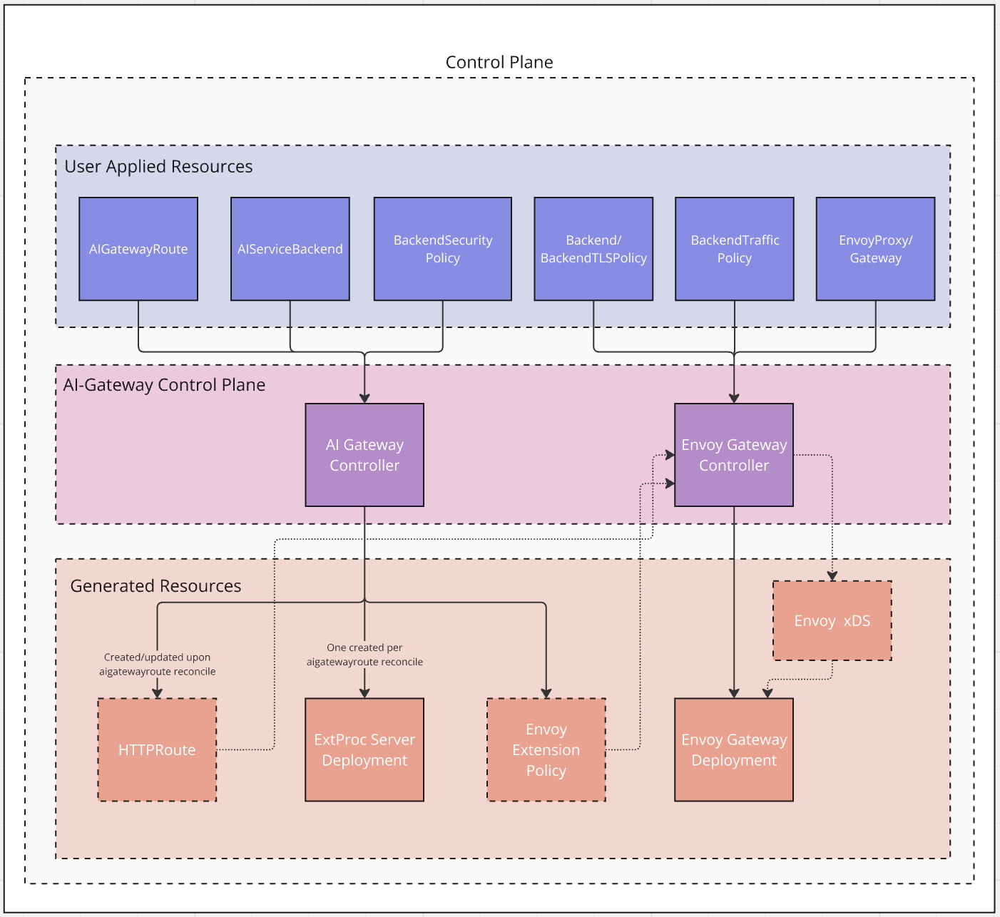
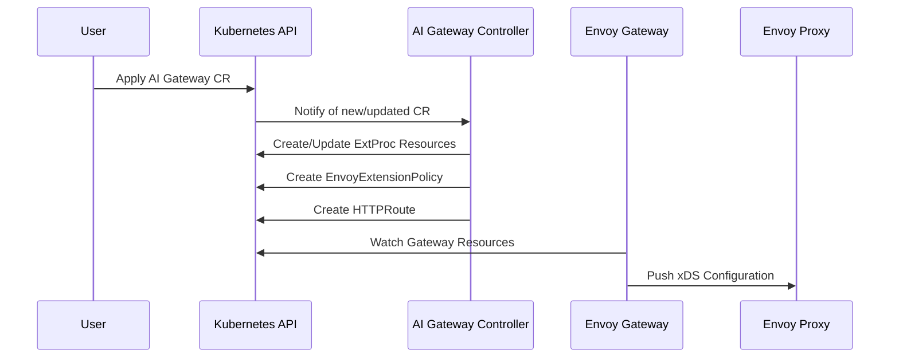

# Control Plane Explained

The control plane is responsible for configuring and managing the system. It consists of several key components working together to manage the AI Gateway configuration.

## How It Works

The control plane operates through a chain of components that work together to manage the configuration:

1. The Envoy AI Gateway controller watches the AI Gateway CRD
2. When changes are detected, it updates the Envoy Gateway configuration
3. Envoy Gateway then updates the Envoy Proxy configuration
4. The data plane (Envoy Proxy) processes AI traffic based on this configuration

This architecture ensures a clear separation of concerns, where the AI Gateway controller focuses on AI-specific configuration while leveraging Envoy Gateway for general proxy management.

## Components

### AI Gateway Controller
The AI Gateway Controller manages AI-specific components and configurations:

#### ExtProc Management
- Deploys and configures the External Processor (ExtProc) service
- Creates and updates ExtProc ConfigMaps with processing rules
- Configures ExtProc security policies and authentication
- Manages ExtProc deployments and their lifecycle

#### Resource Management
- Watches AI Gateway Custom Resources (CRs)
- Creates and manages `EnvoyExtensionPolicy` resources
- Configures `HTTPRoute` resources for request routing
- Manages backend security policies and authentication

#### Integration with Envoy Gateway
- Works alongside Envoy Gateway Controller (not directly configuring Envoy)
- Creates resources that Envoy Gateway translates into Envoy configuration
- Manages AI-specific extensions and filters
- Enables token-based rate limiting through metadata

### Envoy Gateway Controller
- Manages the core Envoy configuration through xDS
- Handles service discovery and load balancing
- Manages TLS certificates
- Translates Gateway API resources into Envoy configuration

## Configuration Flow

The configuration flow shows how changes propagate through the system:
1. Users apply AI Gateway Custom Resources (CRs)
2. The AI Gateway Controller processes these CRs
3. It creates or updates necessary resources (ExtProc, EnvoyExtensionPolicy, HTTPRoute)
4. Envoy Gateway watches these resources
5. Finally, it pushes the configuration to Envoy Proxy via xDS

## Next Steps

To learn more:
- Understand the [Data Plane and Traffic Flow](./data-plane.md)
