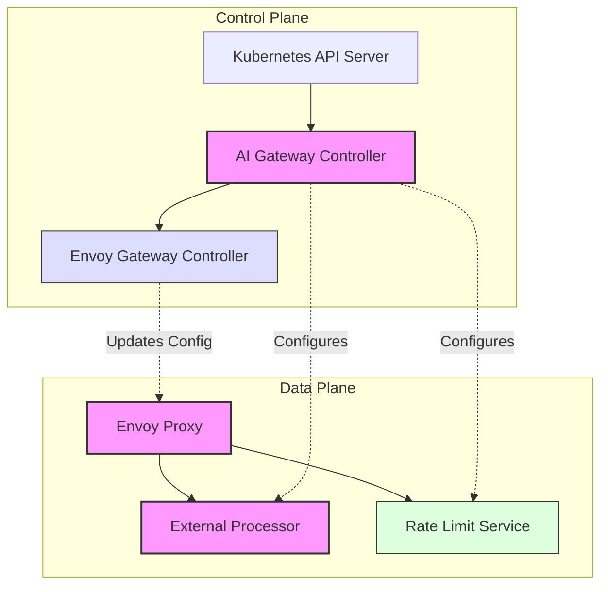
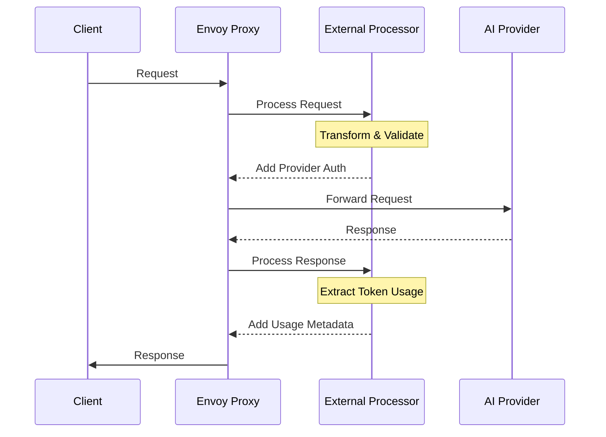

# System Architecture Overview

Envoy AI Gateway follows a modern cloud-native architecture pattern with distinct control and data planes. Let's explore how these components work together to manage AI traffic effectively.

## High-Level Architecture

The architecture is divided into two main planes:

1. **Control Plane**: Responsible for configuring and managing the system
   - Kubernetes API Server serves as the configuration interface
   - AI Gateway Controller manages AI-specific resources and configurations
   - Envoy Gateway Controller handles core proxy configuration and xDS

2. **Data Plane**: Handles the actual request traffic
   - Envoy Proxy and External Processor work together to handle AI traffic
   - Envoy Proxy routes and manages all incoming requests
   - External Processor handles AI-specific transformations and validations
   - Rate Limit Service manages token-based rate limiting

The Control Plane configures the Data Plane through several paths:
- AI Gateway Controller configures the External Processor and Rate Limit Service
- Envoy Gateway Controller configures Envoy Proxy through xDS

## Component Interactions

The system operates through a series of interactions between components:

1. **Configuration Flow**
   - Kubernetes API Server receives configuration changes
   - AI Gateway Controller processes these changes and:
     - Creates resources for Envoy Gateway to consume
     - Configures the External Processor for AI request handling
     - Configures the Rate Limit Service for token-based limiting
   - Envoy Gateway Controller watches gateway resources and:
     - Translates them into Envoy configuration
     - Pushes updates to Envoy Proxy via xDS protocol

2. **Request Flow**
   - Clients send requests to Envoy Proxy
   - Envoy Proxy routes requests through the External Processor for:
     - Request transformation and validation
     - Provider authentication
     - Token usage tracking
   - Processed requests are sent to AI providers
   - Responses flow back through the same path
   - Rate Limit Service enforces token-based limits

3. **Rate Limiting**
   - External Processor extracts token usage from requests/responses
   - Rate Limit Service receives token usage data
   - Rate limits are enforced based on configured policies
   - Helps manage resource utilization and costs

## Summary

The Envoy AI Gateway architecture provides a robust system for managing AI traffic through:
- Clear separation of control and data plane responsibilities
- Flexible configuration management
- Efficient request processing and transformation
- Token-based rate limiting capabilities

For detailed information about specific components:
- Learn more about the [Control Plane](./control-plane.md) components
- Understand the [Data Plane](./data-plane.md) in detail
